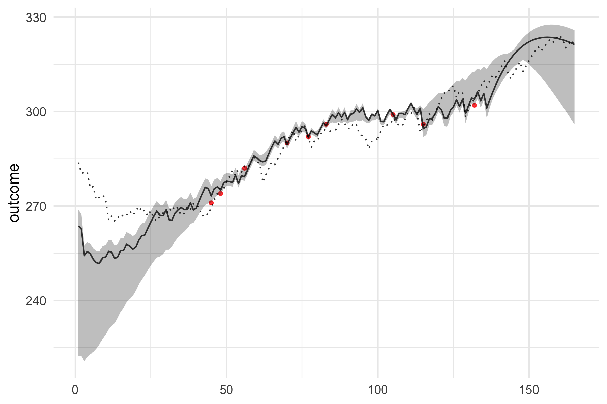
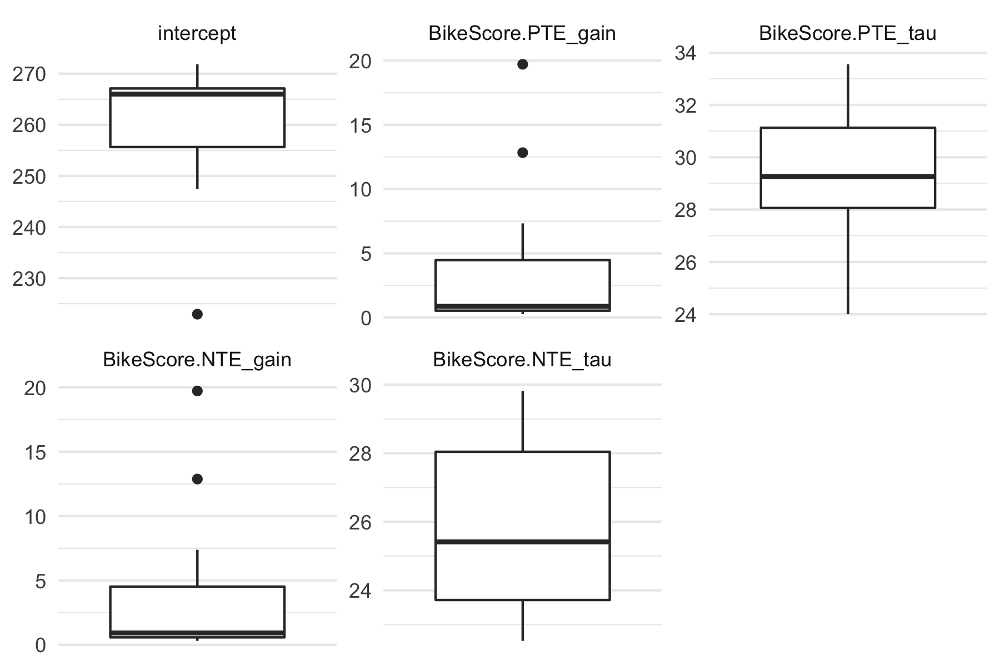
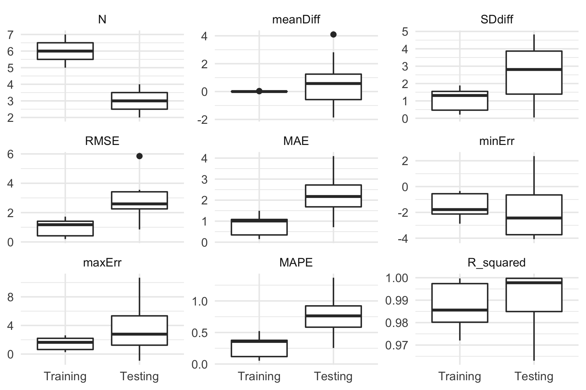

<!-- README.md is generated from README.Rmd. Please edit that file -->

# dorem 

<!-- badges: start -->

[](https://doi.org/10.5281/zenodo.3757085)
<!-- badges: end -->

The goal of `dorem` is to provide easy-to-use dose-response models
utilized in sport science. This package is currently in active
development phases.

## Installation

You can install the development version from
[GitHub](https://github.com/mladenjovanovic/dorem) with:

``` r
# install.packages("devtools")
devtools::install_github("mladenjovanovic/dorem")

require(dorem)
```

## Example

To provide very simplistic example of `dorem`, I will use example data
provided in [supplementary
material](https://journals.physiology.org/doi/full/10.1152/advan.00078.2011m)
of Clarke & Skiba, 2013
[paper](https://journals.physiology.org/doi/full/10.1152/advan.00078.2011?),
freely available on the publisher website. Data set contains cycling
training load (i.e. dose) measured using the BikeScore metric (in AU)
over 165 days, with occasional training response measured using 5-min
Power Test (in Watts). *Banister* model (explained in aforementioned
paper) is applied to understand relationship between *training dose*
(i.e., BikeScore metric) and *training response* (i.e., 5-min Power
Test):

``` r
require(dorem)
require(tidyverse)
require(cowplot)

data("bike_score")

banister_model <- dorem(
   Test_5min_Power ~ BikeScore,
   bike_score,
   method = "banister"
)

# Print results
banister_model
#> Dose-Response Model using banister method
#> Training data consists of 1 predictor and 165 observations
#> Coefficients are estimated using L-BFGS-B method with 1000 max iterations and -Inf VTR
#> 
#> The following start and bound values were used:
#> 
#>                    start lower upper
#> intercept            271     0   302
#> BikeScore.PTE_gain     1     0 10000
#> BikeScore.PTE_tau     21     0   300
#> BikeScore.NTE_gain     3     0 10000
#> BikeScore.NTE_tau      7     0   300
#> 
#> Estimated model coefficients are the following:
#> 
#>          intercept BikeScore.PTE_gain  BikeScore.PTE_tau BikeScore.NTE_gain 
#>        266.0204779          0.3020749         33.6433797          0.3514750 
#>  BikeScore.NTE_tau 
#>         24.6056388 
#> 
#> Objective function equal to: 2.1939 
#> 
#> Cross-Validation of the model was not performed. Shuffling of the predictors was not performed.
#> 
#> Overall model performance using selected estimators is the following:
#> 
#>              training
#> N          9.00000000
#> meanDiff   0.01374013
#> SDdiff     1.57096328
#> RMSE       1.48118212
#> MAE        1.16731419
#> minErr    -2.71352646
#> maxErr     2.22332820
#> MAPE       0.40904959
#> R_squared  0.97975692

# get coefs
coef(banister_model)
#>          intercept BikeScore.PTE_gain  BikeScore.PTE_tau BikeScore.NTE_gain 
#>        266.0204779          0.3020749         33.6433797          0.3514750 
#>  BikeScore.NTE_tau 
#>         24.6056388

# Get model predictions
bike_score$pred <- predict(banister_model, bike_score)$.pred

# Plot
dose <- ggplot(bike_score, aes(x = Day, y = BikeScore)) +
  theme_cowplot(10) +
  geom_bar(stat = "identity") +
  xlab(NULL)

response <- ggplot(bike_score, aes(x = Day, y = pred)) +
   theme_cowplot(10) +
   geom_line() +
   geom_point(aes(y = Test_5min_Power), color = "red") +
   ylab("Test 5min Power")

cowplot::plot_grid(dose, response, ncol = 1)
```


`dorem` also allows more control and setup using the `control`
parameter. In the next example, cross-validation of 3 repeats and 5
folds will be performed, with additional feature of *shuffling* the
predictors and evaluating how the model predicts on random predictors
(i.e., dose):

``` r
banister_model <- dorem(
   Test_5min_Power ~ BikeScore,
   bike_score,
   method = "banister",
   
   # control setup
   control = dorem_control(
    shuffle = TRUE,
    optim_method = "L-BFGS-B",
    optim_maxit = 1000,
    cv_folds = 3,
    cv_repeats = 5
   )
)   

banister_model
#> Dose-Response Model using banister method
#> Training data consists of 1 predictor and 165 observations
#> Coefficients are estimated using L-BFGS-B method with 1000 max iterations and -Inf VTR
#> 
#> The following start and bound values were used:
#> 
#>                    start lower upper
#> intercept            271     0   302
#> BikeScore.PTE_gain     1     0 10000
#> BikeScore.PTE_tau     21     0   300
#> BikeScore.NTE_gain     3     0 10000
#> BikeScore.NTE_tau      7     0   300
#> 
#> Estimated model coefficients are the following:
#> 
#>          intercept BikeScore.PTE_gain  BikeScore.PTE_tau BikeScore.NTE_gain 
#>        266.0204779          0.3020749         33.6433797          0.3514750 
#>  BikeScore.NTE_tau 
#>         24.6056388 
#> 
#> Objective function equal to: 2.1939 
#> 
#> Cross-Validation of the model was performed using 5 repeats of 3 folds. Shuffling of the predictors was performed.
#> 
#> Overall model performance using selected estimators is the following:
#> 
#>              training         CV       shuffle
#> N          9.00000000 45.0000000  9.000000e+00
#> meanDiff   0.01374013  0.5492457  2.140563e-05
#> SDdiff     1.57096328  3.0658154  1.388387e+00
#> RMSE       1.48118212  3.0809127  1.308984e+00
#> MAE        1.16731419  2.2366433  1.122197e+00
#> minErr    -2.71352646 -4.0691138 -2.073424e+00
#> maxErr     2.22332820 10.6731494  2.029794e+00
#> MAPE       0.40904959  0.7745906  3.904557e-01
#> R_squared  0.97975692  0.9202709  9.841818e-01
```

To plot model predictions, including the CV as gray area and shuffle as
dotted line, use:

``` r
plot(banister_model, type = "pred") + theme_minimal()
```



To plot model coefficients across CV folds:

``` r
plot(banister_model, type = "coef") + theme_minimal()
```



To plot model performance across CV folds (i.e., training and testing
folds):

``` r
plot(banister_model, type = "perf") + theme_minimal()
```



## References

Clarke DC, Skiba PF. 2013. Rationale and resources for teaching the
mathematical modeling of athletic training and performance. Advances in
Physiology Education 37:134–152. DOI: 10.1152/advan.00078.2011.
